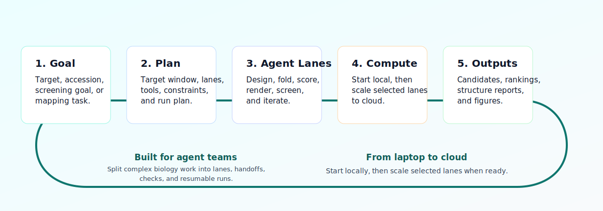
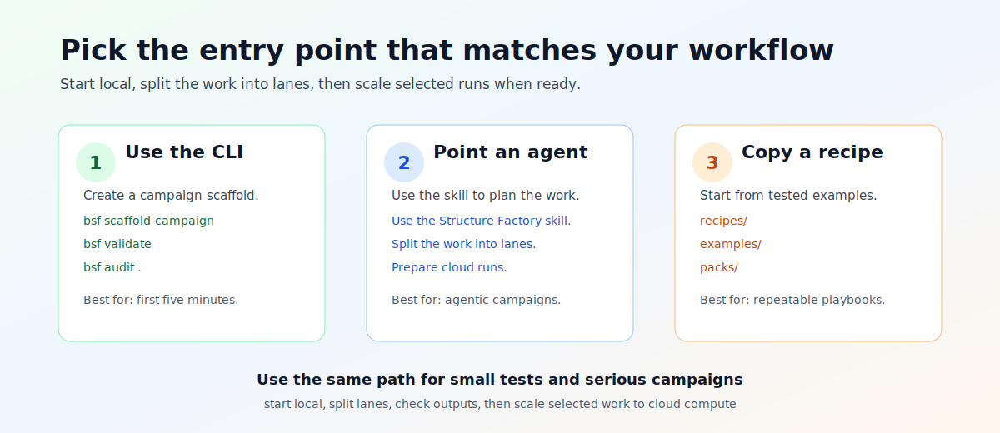
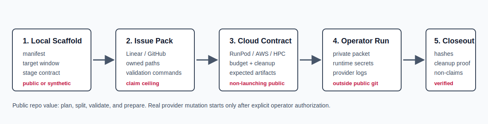

# BioSymphony Structure Factory

[](LICENSE)
[](https://www.python.org/downloads/)
[](#status)

An agent skill for structural biology campaigns such as binder design, screening, and structural dossiers.



Text equivalent: start with a biological intent, turn it into a target and evidence contract, split it into agent lanes, run on local or cloud resources, and produce verifiable artifacts and reports.

Structure Factory takes a campaign idea and produces the contracts and scaffolding an agent team needs to finish it:

```text
biological intent
  -> target and evidence contract
  -> agent lanes (design, cofold, render, dossier, screening)
  -> compute contract (local or cloud, with budget and cleanup)
  -> stage ledger and artifact verification
  -> ranked candidate jury or evidence dossier
  -> signed closeout with provenance
```

The repo ships JSON schemas, scaffolds, agent skill instructions, issue packs, provider profiles for local and cloud GPU, validators, a `bsf` CLI, and worked examples. An agent that reads this repo can pick up a structural biology mission and drive it to completion across multiple workers and providers.

## How To Use This

Structure Factory is an agent skill. The intended workflow is short:

1. Point your agent (Claude Code, Codex, Symphony with Linear, or any runtime that reads skill files) at this repo.
2. Tell the agent to use the BioSymphony Structure Factory skill. The skill lives at [`skills/biosymphony-structure-factory/SKILL.md`](skills/biosymphony-structure-factory/SKILL.md) (portable) and [`.codex/skills/biosymphony-structure-factory/SKILL.md`](.codex/skills/biosymphony-structure-factory/SKILL.md) (Codex-style).
3. Hand the agent a mission (see the prompts below). The agent reads the skill, scaffolds the campaign, validates the contract, generates issue drafts, and (with operator approval) prepares provider runs.

You do not need to run CLI commands yourself. The CLI exists so the agent has reliable machinery to call, and so power users can inspect what the agent will do. See [Inspect Or Run The Repo Yourself](#inspect-or-run-the-repo-yourself) if you want to drive it directly.

## Hand A Mission To An Agent

```text
Use the BioSymphony Structure Factory skill. Run a binder-design campaign against PDB 4ZQK with a target-window dossier, hotspot-conditioned generation lanes, Boltz cofold triage, ranked candidate jury, and a claim ledger. Dispatch via Symphony with Linear using three workers.
```

```text
Use the Structure Factory skill. Build a GPCR activation-state atlas from public PDB accessions, split into receptor and state waves, prepare RunPod launch contracts, and produce per-wave evidence dossiers. Coordinate through Linear.
```

```text
Use the Structure Factory skill. Take this EMPIAR raw subset, hand off raw processing to CryoCore, and own the downstream map-to-model dossier and figure pack. Run locally first, then prepare an AWS Batch contract for the render lane.
```

More prompts in [`docs/use-cases.md`](docs/use-cases.md). Tool and lane reference in [`tools/`](tools/).

## What Users And Their Agents Can Run

| Mission | First Move | Lanes And Outputs |
| --- | --- | --- |
| Binder hunt against a public interface | [`examples/pd-l1-binder-design-public`](examples/pd-l1-binder-design-public) or `bsf scaffold-campaign --mode binder-design` | target-window dossier, Genie3 or RFdiffusion generation, Boltz or Chai cofold triage, ranked candidate jury |
| GPCR or multimer state atlas | `bsf scaffold-campaign --mode structure-dossier` or ask the skill | receptor and state issue waves, deposited-structure dossiers, MPNN or ChimeraX render contracts, switch reports |
| Screening and active learning | [`examples/screening-superpowers`](examples/screening-superpowers) | fixture run, fanout estimate, sharded result schemas, candidate dossiers across cloud queues |
| PDB or EMDB evidence dossier | [`recipes/map-model-dossier-public-data.md`](recipes/map-model-dossier-public-data.md) | accession provenance, validation plan, figure outlines, multi-tool model jury |
| Cryo-EM raw-to-atomic dossier | [`examples/empiar-10204-v0`](examples/empiar-10204-v0) | metadata handoff to CryoCore, downstream dossier contract, deposited-evidence review |
| Multi-tool model jury | [`tools/cofold-scoring-stack.md`](tools/cofold-scoring-stack.md) | comparison of Boltz, Chai, RFdiffusion, and Genie3 outputs with explicit confidence and failure rows |
| Provider-ready cloud campaign | [`runpod/`](runpod/) and [`docs/compute-backends.md`](docs/compute-backends.md) | launch contracts for RunPod, AWS Batch, neocloud, generic cloud VM, or HPC, with budget and cleanup |

Full menu in [`docs/capabilities.md`](docs/capabilities.md) and [`docs/use-cases.md`](docs/use-cases.md).

## Works With Your Stack

**Orchestrators.** Symphony with Linear, Claude Code with Linear, Codex, `/goal` command stacks, GitHub Issues, Notion tasks, and any agent runtime that reads a skill file. The repo ships a Codex-style skill at [`.codex/skills/biosymphony-structure-factory/SKILL.md`](.codex/skills/biosymphony-structure-factory/SKILL.md) and a portable copy at [`skills/biosymphony-structure-factory/SKILL.md`](skills/biosymphony-structure-factory/SKILL.md) that drops into other runtimes.

**Compute.** Local workstation (no GPU required for planning), RunPod pods, AWS Batch and EC2 GPU, neocloud GPU pods, generic cloud VMs, and SSH or HPC. Each provider has a profile that carries budget, cleanup, license-gate, and closeout requirements.

**Tools and lanes referenced or integrated.** Genie3, RFdiffusion, HelixDiff, PepGLAD, EvoBind, and ProteinMPNN for design. Boltz, Chai, and cofold-scoring stacks for prediction. ChimeraX and MD or docking lanes for refinement and rendering. Target-prep utilities and screening adapters for end-to-end campaigns. Add your own through [`tools/`](tools/) cards.

**Trackers.** Linear and GitHub Issues are supported through tracker-neutral issue packs. Notion and custom queues consume the same shapes.

## Start Here

If you are new, first skim [`docs/workflow-map.md`](docs/workflow-map.md). It explains the local, tracker-coordinated, and cloud-prepared paths.

Then pick a path:

| Path | Best For | First Move |
| --- | --- | --- |
| Agent skill | Handing the mission to Claude Code, Codex, Symphony, or any worker | Tell the agent: `Use the BioSymphony Structure Factory skill.` |
| Issue pack | Multi-agent campaign with durable state in Linear or GitHub Issues | Ask the agent to run `bsf issue-dry-run` on a public example |
| Recipe | Following a tested playbook | Open [`recipes/pd-l1-binder-design-fast-path.md`](recipes/pd-l1-binder-design-fast-path.md) |
| CLI directly | Running locally without an agent | See [Inspect Or Run The Repo Yourself](#inspect-or-run-the-repo-yourself) |



Text equivalent: begin with the agent skill for planned multi-step work, the issue pack for multi-agent campaigns, recipes for known workflows, or the CLI when you want to drive it yourself.

## Time Horizons



Text equivalent: local scaffold leads to an issue pack, then a cloud contract, then an operator-gated run outside public git, then verified closeout.

| Time Horizon | What You Get |
| --- | --- |
| 5 minutes | Local CLI working, public example validated, capability catalog rendered |
| 30 minutes | A target idea turned into a scaffold campaign: manifest, dossier, stage contract, claim ledger |
| 60 minutes | Campaign split into tracker-ready Linear or GitHub issues with dependencies and validation commands |
| 2 hours | Multi-provider GPU launch contracts with budget, cleanup, and operator gates |
| Longer, with approval | Operator-gated provider runs with artifact verification, hashes, cost and cleanup proof, and signed closeouts |

## When To Use This

Reach for Structure Factory when a user, Linear ticket, or orchestrator asks for one of these:

- a binder-design campaign scaffold from a public target structure
- a target-window dossier for a protein-protein interface
- a Genie or RFdiffusion-style generation plan with Boltz-style cofold triage
- a GPCR, receptor-state, or multimer-state atlas with issue waves and evidence reports
- a screening or active-learning fixture with fanout and shard ledgers
- a model-jury or structure-dossier plan across predictive and experimental tools
- a RunPod, cloud, HPC, or local GPU launch packet with budget and cleanup
- a publication-style structural report with provenance

Boundaries that this repo does not cross live in [`NON_CLAIMS.md`](NON_CLAIMS.md) and [`BIOSAFETY.md`](BIOSAFETY.md).

## Inspect Or Run The Repo Yourself

You do not need to run these to use Structure Factory. Your agent runs them. These commands are here for power users who want to peek under the hood, run locally without an orchestrator, or build tooling around the same contracts.

```bash
git clone https://github.com/BioSymphony/biosymphony-structure-factory-public.git
cd biosymphony-structure-factory-public
python3 -m venv .venv
source .venv/bin/activate
python -m pip install -e .

bsf --help
bsf doctor .                                       # first-confidence checks
bsf catalog . --format markdown                    # what the repo offers
bsf validate examples/pd-l1-binder-design-public   # validate the flagship example
bsf audit .                                        # public-safety posture
bsf harness-check .                                # load-bearing surface intact
make read-only-audit                               # reviewer checks, no .runtime writes
```

The starter path is local-only and needs no GPU, provider account, network volume, or paid compute. `make read-only-audit` does not write `.runtime/`. `issue-dry-run` writes tracker-neutral Markdown under `.runtime/`, which is ignored and removable with `make clean`.

Scaffold your own public-safe campaign in 60 seconds:

```bash
bsf scaffold-campaign .runtime/pd-l1-binder-demo \
  --campaign-id pd-l1-binder-demo \
  --target-label "PD-L1 public interface demo" \
  --public-accession "PDB:4ZQK" \
  --window "public PD-1/PD-L1 interface window"
bsf validate .runtime/pd-l1-binder-demo
```

Generate tracker-neutral issue drafts:

```bash
bsf issue-dry-run examples/pd-l1-binder-design-public \
  --out .runtime/pd-l1-issues
```

`issue-dry-run` adapts the issue plan to the campaign mode, so binder-design, model-jury, structure-dossier, and screening scaffolds produce different wave prefixes and acceptance criteria.

See [`docs/quickstart-tour.md`](docs/quickstart-tour.md), [`docs/cli-reference.md`](docs/cli-reference.md), [`docs/agent-recipes.md`](docs/agent-recipes.md), [`docs/agentic-biology-harness.md`](docs/agentic-biology-harness.md), and [`docs/skill-install.md`](docs/skill-install.md) for the full workflow.

## BioSymphony Harness

The repo is designed to slot into any agent runtime. It provides:

- a Codex-compatible skill at [`.codex/skills/biosymphony-structure-factory/SKILL.md`](.codex/skills/biosymphony-structure-factory/SKILL.md)
- a portable skill copy at [`skills/biosymphony-structure-factory/SKILL.md`](skills/biosymphony-structure-factory/SKILL.md)
- tracker-neutral Symphony and Linear issue packs under [`packs/`](packs/)
- RunPod and cloud launch contracts under [`runpod/`](runpod/)
- tool cards for design, cofolding, refinement, and visualization under [`tools/`](tools/)
- JSON schemas, validators, and audit gates for public-safe biological work
- a capability catalog: `bsf catalog . --format markdown`
- a local scaffold command: `bsf scaffold-campaign`

The operating model is described in [`docs/agentic-biology-harness.md`](docs/agentic-biology-harness.md). Structure Factory turns biological intent into target and data contracts, agent lanes, provider profiles, artifact checks, candidate juries, and verifiable closeouts. The orchestrator drives planning and execution. Structure Factory provides the biology-correct contracts, scaffolding, and validation surface.

The short version:

```text
local scaffold -> issue pack -> provider contract -> operator-gated run -> verified closeout
```

Users can stop at any step and still get value. The local scaffold is useful on its own for planning. The issue pack is ready for Linear or GitHub Issues. The provider contract is ready for RunPod, AWS Batch, SSH or HPC, neocloud, or local GPU prep. The final cloud run requires operator authorization and lives outside public git.

## Binder-Design Fast Path

The starter example is [`examples/pd-l1-binder-design-public`](examples/pd-l1-binder-design-public). It shows the intended shape:

1. define a public target window from PDB `4ZQK`
2. declare hotspot-conditioned binder-generation lanes
3. gate GPU runtime setup and license or use-context assumptions
4. generate a candidate jury contract
5. cap every output at `computational_candidate` evidence

Structure Factory compresses the front half of binder discovery: target preparation, generation setup, GPU launch contracts, cofold triage, ranking, and evidence packaging. Wet-lab validation and binding confirmation happen outside the repo.

## Newcomer Resources

- [`docs/faq.md`](docs/faq.md). Common questions about GPUs, trackers, agents, and adding your own tools.
- [`docs/glossary.md`](docs/glossary.md). Structural biology and Structure Factory terms a newcomer or general-purpose agent may want defined.
- [`docs/workflow-map.md`](docs/workflow-map.md). The local-to-tracker-to-cloud ladder.
- [`docs/quickstart-tour.md`](docs/quickstart-tour.md). Five-minute local tour for power users.
- [`docs/use-cases.md`](docs/use-cases.md). Copyable agent prompts for each mission type.

## Hard-Earned Operational Knowledge

Read these before any paid GPU dispatch. They are not theoretical — every entry has cost real wall-clock to surface.

- [`docs/operational-gotchas.md`](docs/operational-gotchas.md). Pattern library of ~45 failure classes (RunPod payload limits, conda env traps, designer-specific gotchas, cofold output-field traps, orchestration cascade failures). Each entry includes a paste-ready pre-flight probe and a fix recipe.
- [`docs/preflight-checklist.md`](docs/preflight-checklist.md). Ten-gate pre-dispatch checklist pattern (PDB chain identity, hotspot atom-spec validity, output-count validation, operator approval, and seven more). Catches the highest-EV failure modes at zero cost.
- [`docs/agent-run-learnings.md`](docs/agent-run-learnings.md). Durable lessons across past Structure Factory campaigns: RunPod operational principles, Boltz runner lessons, evidence-integrity rules, the silent-cascade failure pattern, and smoke-discipline.
- [`docs/no-false-success-hardening.md`](docs/no-false-success-hardening.md). The closeout discipline the catalog and checklist enforce.

## Public Release

Before publishing or handing this repo to a fresh in-repo agent, read [`PUBLIC_RELEASE.md`](PUBLIC_RELEASE.md) and [`docs/public-switch-checklist.md`](docs/public-switch-checklist.md). The full local public-switch gate is:

```bash
make public-switch-check
```

Bridge manifests in [`runpod/bridge-manifests`](runpod/bridge-manifests/) are public non-launchable templates. Live provider packets with concrete placement, real approvals, or accepted-license state belong outside public git.

## Repository Layout

```text
campaigns/  Public campaign specs, wave plans, and issue drafts
demos/      Curated result narratives and artifact browsers
docs/       Workflow, capability, agent-recipe, claim, provider, and licensing guidance
examples/   Public binder-design and EMPIAR examples
modules/    Reusable data, lane, provider, image, artifact, and schema contracts
packs/      Tracker-neutral issue packs for Symphony and Linear workflows
runpod/     Launch templates, manifests, entrypoints, and stage contracts
schemas/    JSON schema references for consumers
scripts/    Validators, materializers, dry-run generators, and stage checks
skills/     Agent skill instructions
src/        bsf CLI: validator, scaffolder, catalog, audit
templates/  Issue and campaign templates
tests/      Public release checks
tools/      Tool and lane cards
```

See [`docs/public-export-shape.md`](docs/public-export-shape.md) for the public boundary used for this export.

## Evidence And Safety Posture

Every closeout carries an evidence mode and a claim level so that artifacts and reports are reviewable across agents and reviewers. Vocabulary lives in [`docs/claim-and-evidence.md`](docs/claim-and-evidence.md). Boundaries the repo does not cross live in [`NON_CLAIMS.md`](NON_CLAIMS.md) and [`BIOSAFETY.md`](BIOSAFETY.md). Release hygiene is documented in [`PUBLIC_RELEASE.md`](PUBLIC_RELEASE.md).

## Status

Pre-alpha. The campaign-planning, issue-pack, provider-contract, and audit surfaces work today across the included examples and demos. Wet-lab execution, clinical validation, and storage of private biological data live outside this repo.
