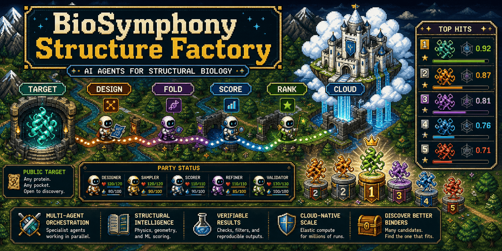
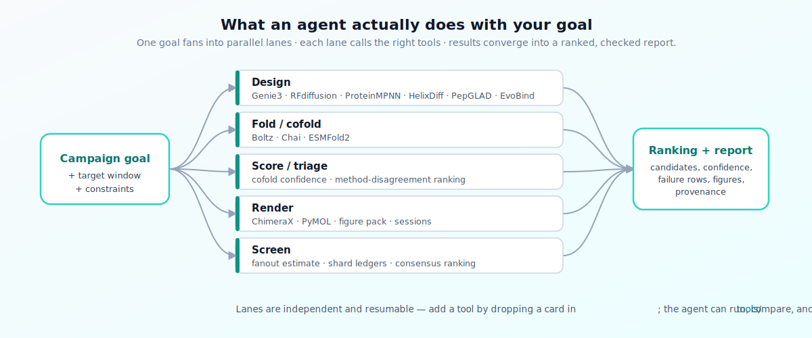
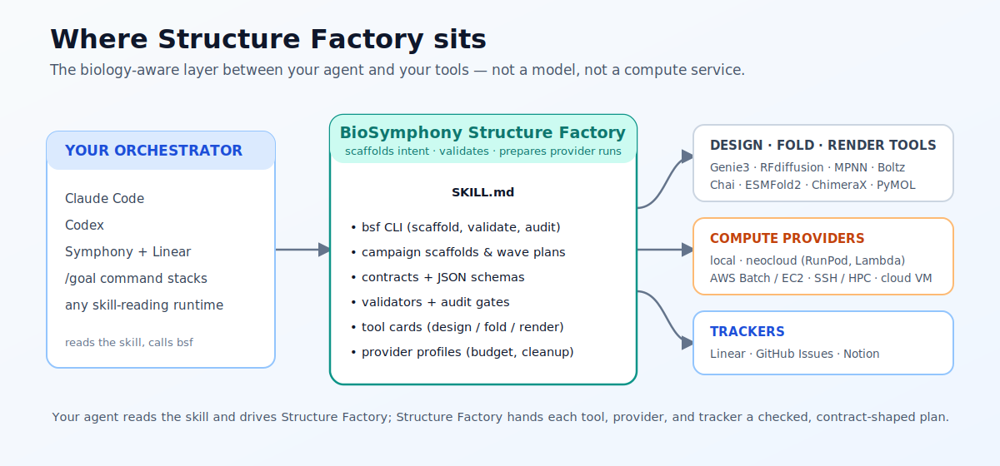

# BioSymphony Structure Factory

[](LICENSE)
[](https://www.python.org/downloads/)
[](#status)

An agent toolkit for structural biology workflows: design binders, map structures, screen candidates, plan prediction lanes, and scale runs across local or cloud compute.


Text equivalent: start with a biological goal, split it into agent lanes, run local or cloud resources, and produce checked outputs, rankings, reports, and figures.

Structure Factory takes a structural biology goal and gives an agent team the rails to work through it:

```text
biological goal
  -> target window or structure set
  -> agent lanes (design, fold, score, render, screen)
  -> local or cloud compute plan
  -> checked outputs and candidate rankings
  -> reports, figures, and next-step work
```

The repo ships campaign scaffolds, agent skill instructions, task templates, provider profiles for local and cloud GPU, validators, a `bsf` CLI, and worked examples. An agent that reads this repo can pick up a structural biology mission and drive it across multiple workers and providers.

## How To Use This

Structure Factory is an agent skill. The intended workflow is short:

1. Point your agent (Claude Code, Codex, Symphony with Linear, or any runtime that reads skill files) at this repo.
2. Tell the agent to use the BioSymphony Structure Factory skill. The skill lives at [`skills/biosymphony-structure-factory/SKILL.md`](skills/biosymphony-structure-factory/SKILL.md).
3. Hand the agent a mission (see the prompts below). The agent reads the skill, scaffolds the campaign, validates the plan, writes task drafts, and (with operator approval) prepares provider runs.

You do not need to run CLI commands yourself. The CLI exists so the agent has reliable machinery to call, and so power users can inspect what the agent will do. See [Inspect Or Run The Repo Yourself](#inspect-or-run-the-repo-yourself) if you want to drive it directly.

## Hand A Mission To An Agent

> Use the BioSymphony Structure Factory skill. Run a binder-design campaign against PDB 4ZQK with a target window, hotspot-conditioned design lanes, Boltz cofold triage, candidate ranking, and a cloud run plan. Dispatch via Symphony with Linear using three workers.

> Use the Structure Factory skill. Build a GPCR activation-state atlas from public PDB accessions, split into receptor and state waves, prepare prediction and render lanes, and produce per-state summaries. Coordinate through Linear.

> Use the Structure Factory skill. Take this EMPIAR raw subset, hand off raw processing to CryoCore, and own the downstream map-to-model workflow and figure pack. Run locally first, then prepare an AWS Batch contract for the render lane.

More prompts in [`docs/use-cases.md`](docs/use-cases.md). Tool and lane reference in [`tools/`](tools/).

## What Users And Their Agents Can Run

| Mission | First Move | Lanes And Outputs |
| --- | --- | --- |
| Binder hunt against a public interface | [`examples/pd-l1-binder-design-public`](examples/pd-l1-binder-design-public) or `bsf scaffold-campaign --mode binder-design` | target setup, Genie3 or RFdiffusion generation, Boltz or Chai cofold triage, candidate ranking |
| GPCR or multimer state atlas | Ask the skill to scaffold a state-atlas campaign | receptor/state work plan, prediction lanes, MPNN or ChimeraX render runs, switch reports |
| Screening and active learning | [`examples/screening-superpowers`](examples/screening-superpowers) | fixture run, fanout estimate, sharded result schemas, candidate reports across cloud queues |
| PDB or EMDB structure mapping | [`recipes/`](recipes/) | accession provenance, validation plan, figure outlines, multi-tool model comparison |
| Cryo-EM raw-to-atomic handoff | [`examples/empiar-10204-v0`](examples/empiar-10204-v0) | metadata handoff to CryoCore, downstream map-to-model workflow, figure pack |
| Multi-tool model comparison | [`tools/cofold-scoring-stack.md`](tools/cofold-scoring-stack.md) | comparison of Boltz, Chai, RFdiffusion, and Genie3 outputs with confidence and failure rows |
| Provider-ready cloud campaign | [`runpod/`](runpod/) and [`docs/compute-backends.md`](docs/compute-backends.md) | launch contracts for RunPod, Lambda Cloud, Modal, and other neoclouds, AWS Batch, generic cloud VM, or HPC, with budget and cleanup |

Full menu in [`docs/capabilities.md`](docs/capabilities.md) and [`docs/use-cases.md`](docs/use-cases.md).



Text equivalent: one campaign goal fans into parallel lanes: design, fold or cofold, score or triage, render, and screen. Each lane calls its own tools, then converges into a ranked, checked report with candidates, confidence, failure rows, figures, and provenance.

## Works With Your Stack

**Orchestrators.** Symphony with Linear, Claude Code with Linear, Codex, `/goal` command stacks, GitHub Issues, Notion tasks, and any agent runtime that reads a skill file. The repo ships portable agent instructions at [`skills/biosymphony-structure-factory/SKILL.md`](skills/biosymphony-structure-factory/SKILL.md).

**Compute.** Local workstation (no GPU required for planning), reviewed neocloud GPU paths (RunPod pods, Lambda Cloud GPU VMs, and Modal serverless GPU functions), AWS Batch and EC2 GPU, generic cloud VMs, and SSH or HPC. Each provider has a profile that carries budget, cleanup, license-gate, and closeout requirements.

**Tools and lanes referenced or integrated.** Genie3, RFdiffusion, HelixDiff, PepGLAD, EvoBind, and ProteinMPNN for design. Boltz, Chai, ESMFold2, and cofold-scoring stacks for prediction and foldability review. ChimeraX, PyMOL, and MD or docking lanes for refinement and rendering. Target-prep utilities and screening adapters for end-to-end campaigns. Add your own through [`tools/`](tools/) cards. For standalone agent skills built around PyMOL, ChimeraX, AlphaFold DB, RCSB PDB, UniProt, and Rosetta, see the companion repo [Proteus](https://github.com/jvogan/proteus).

**Trackers.** Linear and GitHub Issues are supported through tracker-neutral task templates. Notion and custom queues consume the same shapes.

## Start Here

If you are new, first skim [`docs/workflow-map.md`](docs/workflow-map.md). It explains the local, tracker-coordinated, and cloud-prepared paths.

Then pick a path:

| Path | Best For | First Move |
| --- | --- | --- |
| Agent skill | Handing the mission to Claude Code, Codex, Symphony, or any worker | Tell the agent: `Use the BioSymphony Structure Factory skill.` |
| Multi-agent plan | Campaign with durable state in Linear or GitHub Issues | Ask the agent to run `bsf issue-dry-run` on a public example |
| Recipe | Following a tested playbook | Open [`recipes/pd-l1-binder-design-fast-path.md`](recipes/pd-l1-binder-design-fast-path.md) |
| CLI directly | Running locally without an agent | See [Inspect Or Run The Repo Yourself](#inspect-or-run-the-repo-yourself) |


Text equivalent: begin with the agent skill for planned multi-step work, a multi-agent task plan for campaigns, recipes for known workflows, or the CLI when you want to drive it yourself.

## Time Horizons


Text equivalent: local scaffold leads to a multi-agent task plan, then a cloud contract, then an operator-gated run, then checked outputs.

| Time Horizon | What You Get |
| --- | --- |
| 5 minutes | Local CLI working, public example validated, capability catalog rendered |
| 30 minutes | A target idea turned into a scaffold campaign: manifest, target window, stage contract, run plan |
| 60 minutes | Campaign split into tracker-ready Linear or GitHub tasks with dependencies and validation commands |
| 2 hours | Multi-provider GPU launch contracts with budget, cleanup, and operator gates |
| Longer, with approval | Operator-gated provider runs with artifact verification, hashes, cost and cleanup proof, and signed closeouts |

## When To Use This

Reach for Structure Factory when a user, Linear ticket, or orchestrator asks for one of these:

- a binder-design campaign scaffold from a public target structure
- a target-window plan for a protein-protein interface
- a Genie or RFdiffusion-style generation plan with Boltz-style cofold triage
- a GPCR, receptor-state, or multimer-state atlas with state summaries and renders
- a screening or active-learning fixture with fanout and shard ledgers
- a model-comparison or structure-mapping plan across predictive and experimental tools
- a RunPod, cloud, HPC, or local GPU launch packet with budget and cleanup
- a publication-style structural report with provenance

Result boundaries live in [`NON_CLAIMS.md`](NON_CLAIMS.md) and [`BIOSAFETY.md`](BIOSAFETY.md).

## Inspect Or Run The Repo Yourself

You do not need to run these to use Structure Factory. Your agent runs them. These commands are here for power users who want to peek under the hood, run locally without an orchestrator, or build tooling around the same contracts.

```bash
git clone https://github.com/BioSymphony/structure-factory.git
cd structure-factory
python3 -m venv .venv
source .venv/bin/activate
python -m pip install -e .

bsf --help
bsf doctor .                                       # first-confidence checks
bsf catalog . --format markdown                    # what the repo offers
bsf validate examples/pd-l1-binder-design-public   # validate the flagship example
bsf audit .                                        # release-blocker scan
bsf harness-check .                                # load-bearing surface intact
make read-only-audit                               # reviewer checks, no .runtime writes
```

The starter path is local-only and needs no GPU, provider account, network volume, or paid compute. `make read-only-audit` does not write `.runtime/`. `issue-dry-run` writes tracker-neutral Markdown under `.runtime/`, which is ignored and removable with `make clean`.

Scaffold your own campaign in 60 seconds:

```bash
bsf scaffold-campaign .runtime/pd-l1-binder-demo \
  --campaign-id pd-l1-binder-demo \
  --target-label "PD-L1 public interface demo" \
  --public-accession "PDB:4ZQK" \
  --window "public PD-1/PD-L1 interface window"
bsf validate .runtime/pd-l1-binder-demo
```

Generate tracker-neutral task drafts:

```bash
bsf issue-dry-run examples/pd-l1-binder-design-public \
  --out .runtime/pd-l1-issues
```

`issue-dry-run` adapts the task plan to the campaign mode, so binder-design, model comparison, structure mapping, and screening scaffolds produce different wave prefixes and acceptance criteria.

See [`docs/quickstart-tour.md`](docs/quickstart-tour.md), [`docs/cli-reference.md`](docs/cli-reference.md), [`docs/agent-recipes.md`](docs/agent-recipes.md), [`docs/agentic-biology-harness.md`](docs/agentic-biology-harness.md), and [`docs/skill-install.md`](docs/skill-install.md) for the full workflow.

## BioSymphony Harness

The repo is designed to slot into any agent runtime. It provides:

- portable agent instructions at [`skills/biosymphony-structure-factory/SKILL.md`](skills/biosymphony-structure-factory/SKILL.md)
- tracker-neutral Symphony and Linear task templates under [`packs/`](packs/)
- RunPod and cloud launch contracts under [`runpod/`](runpod/)
- tool cards for design, cofolding, refinement, and visualization under [`tools/`](tools/)
- JSON schemas, validators, and audit gates for biological agent work
- a capability catalog: `bsf catalog . --format markdown`
- a local scaffold command: `bsf scaffold-campaign`

The operating model is described in [`docs/agentic-biology-harness.md`](docs/agentic-biology-harness.md). Structure Factory turns biological goals into target setup, agent lanes, provider profiles, artifact checks, candidate rankings, and reviewable closeouts. The orchestrator drives planning and execution. Structure Factory provides the biology-aware scaffolding and validation surface.



Text equivalent: your orchestrator (Claude Code, Codex, Symphony with Linear, or any skill-reading runtime) drives Structure Factory. Structure Factory provides the skill, CLI, scaffolds, contracts, validators, and tool cards that hand checked plans to design, fold, and render tools, compute providers, and trackers.

The short version:

```text
local scaffold -> multi-agent task plan -> provider contract -> operator-gated run -> checked outputs
```

Users can stop at any step and still get value. The local scaffold is useful on its own for planning. The task plan is ready for Linear or GitHub Issues. The provider contract is ready for RunPod and other neoclouds, AWS Batch, SSH or HPC, or local GPU prep. The final cloud run requires operator authorization and lives outside public git.

## Binder-Design Fast Path

The starter example is [`examples/pd-l1-binder-design-public`](examples/pd-l1-binder-design-public). It shows the intended shape:

1. define a public target window from PDB `4ZQK`
2. declare hotspot-conditioned binder-generation lanes
3. gate GPU runtime setup and license or use-context assumptions
4. generate a candidate ranking plan
5. keep output labels tied to what was actually run

Structure Factory compresses the front half of binder discovery: target preparation, generation setup, GPU launch contracts, cofold triage, ranking, and result packaging. Wet-lab validation and binding confirmation happen outside the repo.

## Newcomer Resources

- [`docs/faq.md`](docs/faq.md). Common questions about GPUs, trackers, agents, and adding your own tools.
- [`docs/glossary.md`](docs/glossary.md). Structural biology and Structure Factory terms a newcomer or general-purpose agent may want defined.
- [`docs/workflow-map.md`](docs/workflow-map.md). The local-to-tracker-to-cloud ladder.
- [`docs/quickstart-tour.md`](docs/quickstart-tour.md). Five-minute local tour for power users.
- [`docs/use-cases.md`](docs/use-cases.md). Copyable agent prompts for each mission type.

## Operational Notes

Read these before any paid GPU dispatch. These notes capture failure modes that affected wall-clock time, cost, or output quality in prior campaign work.

- [`docs/operational-gotchas.md`](docs/operational-gotchas.md). Pattern library of ~45 failure classes (RunPod payload limits, conda env traps, designer-specific gotchas, cofold output-field traps, orchestration cascade failures). Each entry includes a paste-ready pre-flight probe and a fix recipe.
- [`docs/preflight-checklist.md`](docs/preflight-checklist.md). Ten-gate pre-dispatch checklist pattern (PDB chain identity, hotspot atom-spec validity, output-count validation, operator approval, and seven more). Catches the highest-EV failure modes at zero cost.
- [`docs/agent-run-learnings.md`](docs/agent-run-learnings.md). Durable lessons across past Structure Factory campaigns: RunPod operational principles, Boltz runner lessons, artifact-integrity rules, the silent-cascade failure pattern, and smoke-discipline.
- [`docs/no-false-success-hardening.md`](docs/no-false-success-hardening.md). The closeout discipline the catalog and checklist enforce.

## Public Release

Before publishing or handing this repo to a fresh in-repo agent, read [`PUBLIC_RELEASE.md`](PUBLIC_RELEASE.md) and [`docs/public-switch-checklist.md`](docs/public-switch-checklist.md). The full local public-switch gate is:

```bash
make public-switch-check
```

Bridge manifests in [`runpod/bridge-manifests`](runpod/bridge-manifests/) are public non-launchable shape templates only. Per-campaign provider packets with concrete placement, run IDs, real approvals, runtime secrets, accepted-license state, or prior-run artifacts belong outside public git.

## Repository Layout

```text
campaigns/  Public campaign specs, wave plans, and task drafts
demos/      Curated result narratives and summary examples
docs/       Workflow, capability, agent-recipe, provider, and licensing guidance
examples/   Public binder-design and EMPIAR examples
modules/    Reusable data, lane, provider, image, artifact, and schema contracts
packs/      Tracker-neutral task templates for Symphony and Linear workflows
runpod/     Launch templates, manifests, entrypoints, and stage contracts
schemas/    JSON schema references for consumers
scripts/    Validators, materializers, dry-run generators, and stage checks
skills/     Agent skill instructions
src/        bsf CLI: validator, scaffolder, catalog, audit
templates/  Issue and campaign templates
tests/      Public release checks
tools/      Tool and lane cards
```

See [`docs/public-export-shape.md`](docs/public-export-shape.md) for the public boundary used for this export.

## Validation And Boundaries

Every closeout records what was run, what changed, what artifacts exist, and what still needs independent validation. Boundaries the repo does not cross live in [`NON_CLAIMS.md`](NON_CLAIMS.md) and [`BIOSAFETY.md`](BIOSAFETY.md). Release hygiene is documented in [`PUBLIC_RELEASE.md`](PUBLIC_RELEASE.md).

## Status

Pre-alpha. The campaign-planning, multi-agent task, provider-contract, and audit surfaces work today across the included examples and demos. Wet-lab execution, clinical validation, and storage of private biological data live outside this repo.
