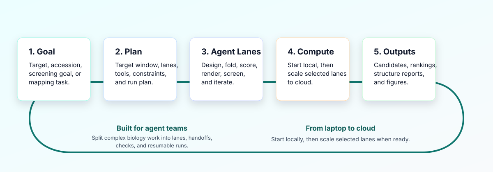
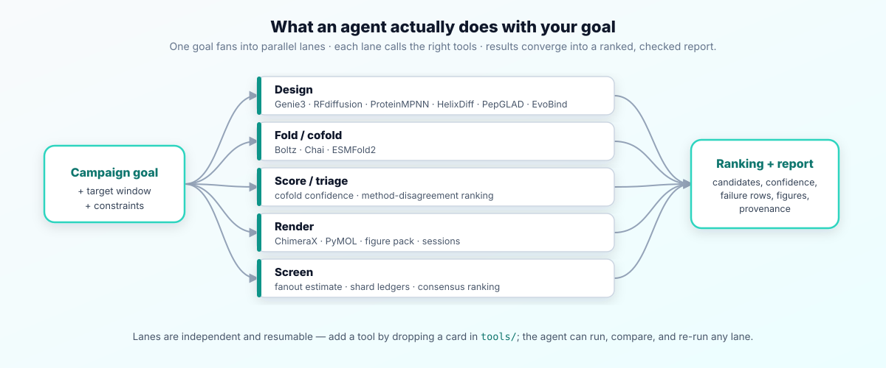
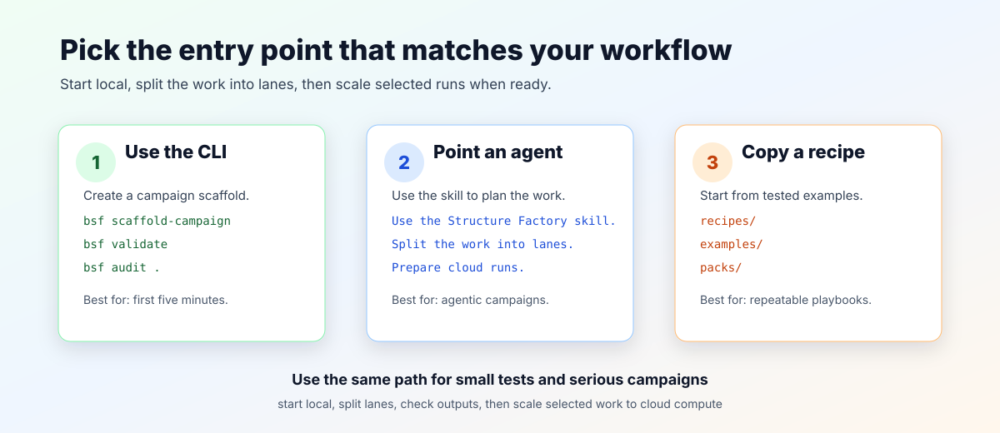
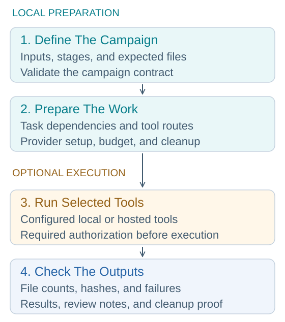
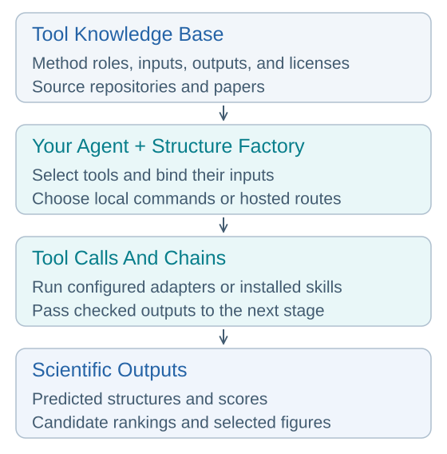

# BioSymphony Structure Factory

[](LICENSE)
[](https://www.python.org/downloads/)
[](#status)

BioSymphony Structure Factory gives you and your AI agent a public, reviewable way to plan structural biology campaigns and record their results. It writes and checks campaign manifests, target windows, task packs, provider contracts, candidate reports, figures, and release records.

## Claude/Anthropic Binder-Study Lane

Structure Factory provides an independent lane for the protein-binder workflow described in [Anthropic's public report](https://www-cdn.anthropic.com/30bf50e22a01388bb29bf077ee3f244531594b7a.pdf) and released in the [Claude Protein Binder Design dataset](https://huggingface.co/datasets/Anthropic/claude-protein-binder-design). Start with the [`binder-lane-round` agent skill](skills/binder-lane-round/SKILL.md). The [binder-lane round guide](docs/binder-lane-round.md) documents the CLI and execution contracts, and the [binder-study decision loop](docs/binder-study-decision-loop.md) defines the choices for each round.

You and your chosen AI agent can replay the published study shape, reproduce the published source-tool identities where the selected route supports them, or record deliberate tool swaps. Choose local, API, FAL, Modal, RunPod, Lambda Cloud, AWS, neocloud, SSH/HPC, or mixed routes by stage. Set budget and runtime ceilings, round and candidate limits, one primary metric, and a stopping rule before execution. Preserve checked outputs with declared counts and hashes, and record receipts, failure rows, cleanup evidence, and selected figures or renders.



Text equivalent: define a biological goal, split it into bounded lanes, prepare local or cloud contracts, and check the resulting artifacts and reports.

Structure Factory represents a structural biology campaign as files that agents and scientists can inspect:

```text
biological goal
  -> target window or structure set
  -> agent lanes (design, fold, score, render, screen)
  -> local or cloud compute plan
  -> checked outputs and candidate rankings
  -> reports, figures, and next-step work
```

The repository includes campaign scaffolds, agent instructions, task templates, provider profiles, validators, the `bsf` CLI, and public examples.

## How To Use This

Point any AI agent that can read Markdown skills at this repository. Tell it to use the [BioSymphony Structure Factory skill](skills/biosymphony-structure-factory/SKILL.md), then give it the following campaign brief.

1. **Target and site.** Choose a public PDB, EMDB, or UniProt accession, or a synthetic fixture. Name the target chain or chains and a bounded residue window or site-selection rule.
2. **Goal and lanes.** Choose binder design, structure mapping, model comparison, screening, a state atlas, a CryoCore handoff, or another documented campaign shape. Select design, fold or cofold, score, render, and screen lanes as needed.
3. **Comparison method.** To repeat or extend Anthropic's published binder-design study, choose an exact source-tool replay, a workflow-shape replay, a deliberate tool swap, or a replay-and-swap comparison. A workflow-shape replay preserves the published stages without claiming the source tool identities.
4. **Tools and routes.** Choose a user-supplied platform skill, hosted API client, self-hosted local tool, FAL, Modal, RunPod, Lambda Cloud, AWS, neocloud, SSH/HPC, or a mixed route for each stage.
5. **Run limits.** Set the spend ceiling, runtime cap, round count, candidate count, primary metric, and stopping rule before the first run.
6. **Closeout.** Declare expected files and counts, hashes, stage or provider receipts, failure-row handling, cleanup evidence, and any visual-review outputs such as figures or renders.

Ask the agent to validate the request, materialize the handoff, and dry-run the selected adapter or client. When a selected record says `adapter_required`, add a validated adapter registry below `.runtime/`; a platform-skill route instead writes its declared outputs and closes them with the same output contract. A provider profile records route requirements. A successful dry run records adapter or client readiness.

Obtain explicit human authorization before a paid provider start, non-public upload, terms acceptance, or large or license-gated download. The approval names the route, data posture, budget, runtime, and applicable terms.

### Copyable Campaign Brief

```text
Use the BioSymphony Structure Factory skill in this repository.
Target and site: <public accession or synthetic fixture; chain(s); residue window or site rule>.
Goal and lanes: <campaign goal; design/fold/score/render/screen lanes>.
Comparison: <source-tool replay, workflow-shape replay, deliberate tool swap, or no comparison>.
Routes: <one route per stage: local, API, platform skill, FAL, Modal, RunPod, Lambda Cloud, AWS, neocloud, SSH/HPC, or mixed>.
Limits: <budget, runtime cap, rounds, candidates per arm, primary metric, stopping rule>.
Closeout: <expected outputs and counts, hashes, receipts, cleanup evidence, figures or renders>.
Validate the request, prepare the handoff, dry-run selected routes, and list any authorization required before execution.
```

You can also run the CLI directly. See [Inspect Or Run The Repo Yourself](#inspect-or-run-the-repo-yourself).

## Hand A Mission To An Agent

> Use the BioSymphony Structure Factory skill. Plan a public binder comparison for PDB 4ZQK at the documented PD-1/PD-L1 interface. Compare a workflow-shape replay with a deliberate tool-swap arm, use local filtering and a hosted cofold API route, set a $75 and three-round limit, and close each stage with counts, hashes, receipts, and a ranked figure-ready report.

> Use the Structure Factory skill. Build a GPCR activation-state atlas from public PDB accessions. Use local preparation, an SSH/HPC prediction route, and a render route, then produce per-state summaries and visual-review outputs with provenance and hashes.

> Use the Structure Factory skill. Record a public EMPIAR handoff for CryoCore, then plan the downstream structure-mapping workflow and figure pack. Prepare an AWS Batch render contract after local validation.

Find more prompts in [`docs/use-cases.md`](docs/use-cases.md). Read the tool and lane reference in [`tools/`](tools/).

## What Users And Their Agents Can Run

| Mission | Public Surface | Verified State | Outputs |
| --- | --- | --- | --- |
| Binder-design planning against a public interface | [`examples/pd-l1-binder-design-public`](examples/pd-l1-binder-design-public) | Local scaffold, validation, and task generation | target window, generation and cofold lane plans, stage contract, candidate-ranking schema |
| Binder toolchain comparison and mixed-backend execution | [`docs/binder-lane-round.md`](docs/binder-lane-round.md) | `bsf binder-lane` target verification, local execution, remote-contract, calibration, closeout, and decision commands | multi-arm plan, replay or swap labels, stage routes, fixed-argument adapters, count-checked receipts |
| GPCR or multimer state-atlas planning | [`docs/use-cases.md`](docs/use-cases.md) | Documented planning pattern | receptor and state work plan, prediction and render lane contracts, state summaries |
| Screening and active learning | [`examples/screening-superpowers`](examples/screening-superpowers) | Local fixture and provider-packet dry run | fanout estimate, shard ledger, ranking rows, selected candidate reports |
| PDB or EMDB structure mapping | [`recipes/`](recipes/) | Public-data recipes and compact report examples | accession provenance, validation plan, report and figure specifications |
| Cryo-EM handoff | [`examples/empiar-10204-v0`](examples/empiar-10204-v0) | Public metadata scaffold | CryoCore handoff record and downstream structure-mapping contract |
| Multi-tool model comparison | [`tools/cofold-scoring-stack.md`](tools/cofold-scoring-stack.md) | Tool and result contract | confidence fields, failure rows, comparison schema, and review criteria |
| Cloud campaign preparation | [`runpod/`](runpod/) and [`docs/compute-backends.md`](docs/compute-backends.md) | Tracked templates, readiness checks, and ignored runtime packets | budget, license, artifact, cleanup, and closeout requirements |

See [`docs/capabilities.md`](docs/capabilities.md) and [`docs/use-cases.md`](docs/use-cases.md) for the full menu.



Text equivalent: one campaign goal splits into design, fold or cofold, score or triage, render, and screen lanes. Each lane can use its selected tools and returns a ranked, checked report with candidates, confidence, failure rows, figures, and provenance.

## Works With Your Stack

- **Agents and trackers:** the Markdown skill and task packs work with Codex, Claude Code, Symphony with Linear, GitHub Issues, and other systems that read the same files.
- **Execution routes:** stage contracts cover local workstations, hosted APIs, platform skills, FAL, Modal, RunPod, Lambda Cloud, AWS, generic cloud VMs, neocloud pods, and SSH/HPC. A campaign can mix routes by stage.
- **Tool records and adapters:** tool cards cover design, prediction, scoring, refinement, rendering, target preparation, and screening. Read [`references/software-registry.yaml`](references/software-registry.yaml) for recorded status and [`docs/tooling-and-licensing.md`](docs/tooling-and-licensing.md) before runtime use. Add a validated `.runtime/` adapter when the selected route needs one.

## Start Here

Read [`docs/workflow-map.md`](docs/workflow-map.md), then pick a path:

| Path | Best For | First Move |
| --- | --- | --- |
| Agent skill | Handing a bounded brief to your chosen AI agent | Tell the agent: `Use the BioSymphony Structure Factory skill.` |
| Multi-agent plan | Campaign with durable state in Linear or GitHub Issues | Ask the agent to run `bsf issue-dry-run` on a public example |
| Recipe | Following a tested playbook | Open [`recipes/pd-l1-binder-design-fast-path.md`](recipes/pd-l1-binder-design-fast-path.md) |
| CLI directly | Running locally without an agent | See [Inspect Or Run The Repo Yourself](#inspect-or-run-the-repo-yourself) |



Text equivalent: begin with the agent skill for planned multi-step work, a multi-agent task plan for campaigns, recipes for known workflows, or the CLI when you want to drive it yourself.

## Workflow Stages



Text equivalent: local planning leads to a task plan, an execution contract, explicit approval when required, and checked outputs.

| Stage | Output | Local Check |
| --- | --- | --- |
| Inspect | capability catalog and example inventory | `bsf catalog . --format markdown` |
| Scaffold | campaign manifest, target window, stage contract, and run plan | `bsf validate <campaign>` |
| Split work | tracker-neutral tasks with dependencies and validation commands | `bsf issue-dry-run <campaign>` |
| Prepare compute | provider profile, tracked template, and ignored runtime packet | provider and stage-contract checks |
| Close a run | declared artifacts and counts, hashes, receipts, validation notes, cost record, cleanup proof, and figures or renders | contract self-check plus scientist review |

## When To Use This

Use Structure Factory when a user, Linear ticket, or orchestrator asks for one of these:

- a binder-design campaign scaffold from a public target structure
- a target-window plan for a protein-protein interface
- a Genie or RFdiffusion-style generation plan with Boltz-style cofold triage
- a GPCR, receptor-state, or multimer-state atlas with state summaries and renders
- a screening or active-learning fixture with fanout and shard ledgers
- a model-comparison or structure-mapping plan across predictive and experimental tools
- a RunPod, cloud, HPC, or local GPU launch packet with budget and cleanup
- a publication-style structural report with provenance

Result boundaries live in [`NON_CLAIMS.md`](NON_CLAIMS.md) and [`BIOSAFETY.md`](BIOSAFETY.md).

## Inspect Or Run The Repo Yourself

Run these commands to inspect the generated contracts or use the repository without an orchestrator.

```bash
git clone https://github.com/BioSymphony/structure-factory.git
cd structure-factory
python3 -m venv .venv
source .venv/bin/activate
python -m pip install -e .

bsf --help
bsf doctor .                                       # local setup and contract checks
bsf catalog . --format markdown                    # what the repo offers
bsf validate examples/pd-l1-binder-design-public   # validate the flagship example
bsf audit .                                        # release-blocker scan
bsf harness-check .                                # load-bearing surface intact
make read-only-audit                               # reviewer checks, no .runtime writes
```

The starter path is local-only and needs no GPU, provider account, network volume, or paid compute. `make read-only-audit` does not write `.runtime/`. `issue-dry-run` writes tracker-neutral Markdown under `.runtime/`, which is ignored and removable with `make clean`.

Scaffold a campaign:

```bash
bsf scaffold-campaign .runtime/pd-l1-binder-demo \
  --campaign-id pd-l1-binder-demo \
  --target-label "PD-L1 public interface demo" \
  --public-accession "PDB:4ZQK" \
  --window "public PD-1/PD-L1 interface window"
bsf validate .runtime/pd-l1-binder-demo
```

Generate tracker-neutral task drafts:

```bash
bsf issue-dry-run examples/pd-l1-binder-design-public \
  --out .runtime/pd-l1-issues
```

`issue-dry-run` adapts the task plan to the campaign mode, so binder-design, model comparison, structure mapping, and screening scaffolds produce different wave prefixes and acceptance criteria.

See [`docs/quickstart-tour.md`](docs/quickstart-tour.md), [`docs/cli-reference.md`](docs/cli-reference.md), [`docs/agent-recipes.md`](docs/agent-recipes.md), [`docs/agentic-biology-harness.md`](docs/agentic-biology-harness.md), and [`docs/skill-install.md`](docs/skill-install.md) for the full workflow.

## BioSymphony Harness

The public harness provides:

- portable agent instructions at [`skills/biosymphony-structure-factory/SKILL.md`](skills/biosymphony-structure-factory/SKILL.md)
- tracker-neutral Symphony and Linear task templates under [`packs/`](packs/)
- RunPod and cloud launch contracts under [`runpod/`](runpod/)
- tool cards for design, cofolding, refinement, and visualization under [`tools/`](tools/)
- JSON schemas, validators, and audit gates for biological agent work
- a capability catalog: `bsf catalog . --format markdown`
- a local scaffold command: `bsf scaffold-campaign`

[`docs/agentic-biology-harness.md`](docs/agentic-biology-harness.md) defines how an orchestrator reads these contracts and records closeout evidence.



Text equivalent: your orchestrator (Claude Code, Codex, Symphony with Linear, or any skill-reading runtime) drives Structure Factory. Structure Factory provides the skill, CLI, scaffolds, contracts, validators, and tool cards that hand checked plans to design, fold, and render tools, compute providers, and trackers.

A campaign can stop after local planning, task generation, or provider preparation. To continue, create ignored runtime bindings or packets, validate the selected adapter, and obtain explicit human authorization. Runtime artifacts stay outside tracked git files.

## Binder-Design Fast Path

The starter example is [`examples/pd-l1-binder-design-public`](examples/pd-l1-binder-design-public). It contains these steps:

1. Define a public target window from PDB `4ZQK`.
2. Declare hotspot-conditioned binder-generation lanes.
3. Record GPU runtime, license, and use-context requirements.
4. Generate a candidate-ranking plan.
5. Keep output labels tied to the completed work.

The example checks target preparation, generation and cofold plans, a ranking schema, and result labels. Wet-lab validation and binding confirmation happen outside the repository.

For comparative rounds, keep the target, controls, prediction panel, scoring, and failure policy consistent across ranked arms. Record comparisons with different methods as exploratory. Before generation, run `target-check --plan <plan.json>` on the coordinate input.

## Newcomer Resources

- [`docs/faq.md`](docs/faq.md). Common questions about GPUs, trackers, agents, and adding your own tools.
- [`docs/glossary.md`](docs/glossary.md). Structural biology and Structure Factory terms a newcomer or general-purpose agent may want defined.
- [`docs/workflow-map.md`](docs/workflow-map.md). The local-to-tracker-to-cloud ladder.
- [`docs/quickstart-tour.md`](docs/quickstart-tour.md). Local tour for people who want to run the CLI.
- [`docs/use-cases.md`](docs/use-cases.md). Copyable agent prompts for each mission type.

## Operational Notes

Read these before a paid GPU dispatch. They describe public checks for provider, predictor, artifact-integrity, and smoke-test work.

- [`docs/operational-gotchas.md`](docs/operational-gotchas.md). Failure classes, preflight probes, and fixes for provider and tool runs.
- [`docs/reproducibility-checks.md`](docs/reproducibility-checks.md). Direct dependency-pin resolution and complete output-tree comparison.
- [`docs/preflight-checklist.md`](docs/preflight-checklist.md). Checks for target identity, hotspot syntax, output counts, human approval, artifacts, and cleanup.
- [`docs/agent-run-learnings.md`](docs/agent-run-learnings.md). Execution checks for provider, predictor, artifact-integrity, and smoke-test work.
- [`docs/no-false-success-hardening.md`](docs/no-false-success-hardening.md). Required output checks and partial-result handling.

## Public Release

Before publishing or handing this repository to a fresh in-repository agent, read [`PUBLIC_RELEASE.md`](PUBLIC_RELEASE.md) and [`docs/public-switch-checklist.md`](docs/public-switch-checklist.md). The full local public-switch gate is:

```bash
make public-switch-check
```

Bridge manifests in [`runpod/bridge-manifests`](runpod/bridge-manifests/) are tracked templates. They omit credentials, live provider IDs, accepted-license state, and authorization. A person working with an agent can materialize an ignored `.runtime/` packet and complete readiness and scope checks. Use a validated adapter only after the approval covers the proposed paid start, data posture, budget, runtime, and applicable terms. Keep concrete placement, run IDs, secrets, approvals, logs, and fetched artifacts out of tracked git files.

## Repository Layout

```text
campaigns/  Public campaign specs, wave plans, and task drafts
demos/      Curated result narratives and summary examples
docs/       Workflow, capability, agent-recipe, provider, and licensing guidance
examples/   Public binder-design and EMPIAR examples
modules/    Reusable data, lane, provider, image, artifact, and schema contracts
packs/      Tracker-neutral task templates for Symphony and Linear workflows
runpod/     Launch templates, manifests, entrypoints, and stage contracts
schemas/    JSON schema references for consumers
scripts/    Validators, materializers, dry-run generators, and stage checks
skills/     Agent skill instructions
src/        bsf CLI: validator, scaffolder, catalog, audit
templates/  Issue and campaign templates
tests/      Public release checks
tools/      Tool and lane cards
```

See [`docs/public-export-shape.md`](docs/public-export-shape.md) for the public boundary used for this export.

## Validation And Boundaries

Every closeout records what was run, what changed, what artifacts exist, and what still needs independent validation. Boundaries the repo does not cross live in [`NON_CLAIMS.md`](NON_CLAIMS.md) and [`BIOSAFETY.md`](BIOSAFETY.md). Release hygiene is documented in [`PUBLIC_RELEASE.md`](PUBLIC_RELEASE.md).

## Status

Pre-alpha. The included local checks cover campaign planning, task generation, provider contracts, public fixtures, and release scans. Provider-backed biological results require separate execution records and scientist review.
