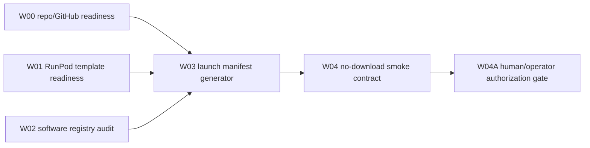
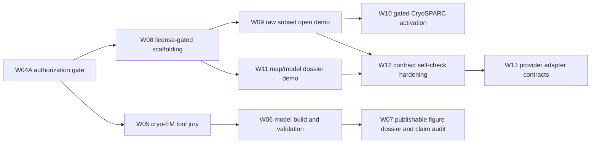

# Cryo-EM Raw To Atomic Dossier Issue DAG

## First Active Wave

## Backlog Waves

Only W00-W04 should start in `Todo` for the first Symphony test. W04A is a non-terminal human/operator gate and must stay out of Symphony active states. W05-W07 stay blocked until W04A is manually approved.

W08-W13 are the RunPod demo and provider-contract hardening wave. W08 is prep-only and can run without licenses. W09 is cost-bearing and raw-download-bearing. W10 requires runtime CryoSPARC/MotionCor3 access. W11 is map/model-only and should not download raw movies. W12 prevents false success by joining inputs, materialized files, executed commands, artifacts, and claim levels before any run closes as successful. W13 keeps RunPod blessed while making local, SSH/HPC, cloud VM, and neocloud adapters explicit.
