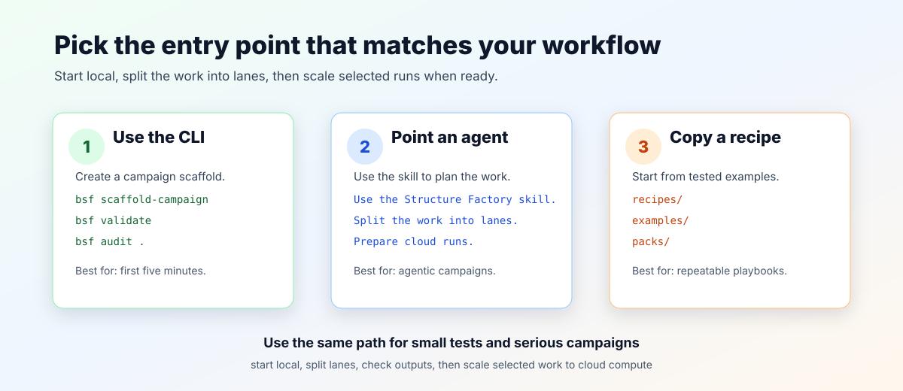

# Quickstart Tour

This tour shows the path from a fresh checkout to a validated campaign scaffold. It does not require a provider account, GPU, private image, model weights, or credentials.



Text equivalent: choose the CLI for a local scaffold, the agent skill for planned agent work, or a recipe for a documented workflow.

For the full local-to-Linear-to-cloud ladder, see [`workflow-map.md`](workflow-map.md).

## What You Should Have After Each Step

| Step | Result |
| --- | --- |
| Install and checks | The CLI, example campaign, and skill files pass their local checks. |
| Scaffold | `.runtime/` contains target setup, a stage contract, and a run plan. |
| Agent review | The target plan and task split include inputs, dependencies, and validation commands. |
| Task dry-run | `.runtime/` contains tracker-neutral work items. |
| Provider prep | The campaign has a checked template and an ignored runtime packet ready for human review. |

## Pick A Starting Mode

| Mode | Use When | First Step |
| --- | --- | --- |
| Local CLI | You want to inspect the repository locally | Run `bsf scaffold-campaign` into `.runtime/` |
| Agent skill | You want Codex or another agent to plan the work | Ask it to use the Structure Factory skill |
| Claude binder lane | You want Claude Code or another agent to replay or compare a public binder workflow | Start with the [Claude binder lane](claude-binder-lane.md) and its [`binder-lane-round` skill](../skills/binder-lane-round/SKILL.md) |
| Recipe | You want a known workflow shape | Start from [`recipes/`](../recipes/) |

You can use your chosen AI agent and assign a different route to each stage. Binder rounds support platform skills, hosted APIs, local or self-hosted tools, and cloud routes.

## 1. Install Locally

```bash
python3 -m venv .venv
source .venv/bin/activate
python -m pip install -e .
```

Check that the command line entry point is available:

```bash
bsf --help
```

## 2. Run The Light Local Checks

```bash
bsf --help
bsf doctor .
bsf catalog .
bsf catalog . --format markdown
bsf validate examples/pd-l1-binder-design-public
make read-only-audit
make harness-check
```

These checks confirm the CLI is installed, both JSON and Markdown catalog views render, the public PD-L1 example validates, the public audit is clean, and the agent/skill harness files are present. The catalog includes task recipes so a new agent can choose a planning, issue-draft, release-review, or cloud-prep path without scanning the full repo. `make read-only-audit` avoids `.runtime/` writes for reviewers. Save `make release-check` and `make public-switch-check` for release preparation or repo handoff.

## 3. Scaffold A Campaign

Write the scaffold to ignored runtime space first:

```bash
bsf scaffold-campaign .runtime/my-target-demo \
  --campaign-id my-target-demo \
  --target-label "A2A receptor" \
  --public-accession "PDB:5G53" \
  --window "TM6 activation microswitch"
```

The scaffold creates:

- `campaign-manifest.json`
- target-window file
- `stage-contract.json`
- run notes
- `README.md`

Validate it:

```bash
bsf validate .runtime/my-target-demo
bsf audit .
```

## 4. Use It With An Agent

Copy this prompt after the scaffold exists:

```text
Use the BioSymphony Structure Factory skill. Review .runtime/my-target-demo, improve the target window, stage contract, task plan, and run notes. Run bsf validate plus bsf audit when done. Stop before external execution unless I explicitly authorize it.
```

For more prompts, see [`docs/use-cases.md`](use-cases.md).

## 5. Turn The Scaffold Into Work

For a real public example, move the scaffold under `examples/<campaign-id>/` only after:

- every input is public accession metadata or synthetic fixture data
- expected artifacts are compact and text-based
- long-running or GPU work requires explicit human authorization
- no generated structures, raw data, provider logs, private paths, or credentials are committed
- output labels are tied to what actually ran

Then generate tracker-neutral task drafts:

```bash
bsf issue-dry-run examples/<campaign-id> --out .runtime/<campaign-id>-issues
```

Those drafts are mode-aware: binder-design, model comparison, structure mapping, and screening campaigns get different prefixes and acceptance criteria. They can be imported into Linear, GitHub Issues, Notion tasks, or another tracker. For Linear/Symphony, keep the routing label, provider fields, owned paths, dependencies, validation commands, and `<!-- symphony:schema -->` block intact.

## 6. Before Any Remote Run

Tracked launch templates intentionally omit live execution state. Before using RunPod, AWS Batch, SSH/HPC, or another cloud GPU path, create an ignored runtime packet under `.runtime/` with:

- explicit authorization
- budget and runtime cap
- cleanup policy
- immutable source reference
- runtime-secret references
- expected artifacts and hashes
- stage-progress ledger
- closeout and downgrade policy

Keep live credentials and provider state out of tracked files. After the packet passes its readiness and scope checks, a user and agent may execute it through a validated adapter with explicit human authorization.

A provider-preparation pass looks like:

```bash
make runpod-public-template-check
make runpod-scope-check
SMOKE_MANIFEST=runpod/launch-manifests/no-download-smoke.json make launch-preflight
make launch-bundle
```

The output is an ignored review bundle under `.runtime/`. Keep provider IDs, credentials, approval records, logs, fetched artifacts, cost reports, and cleanup proof out of tracked git files.

For cloud/provider details, read [`compute-backends.md`](compute-backends.md) and [`runpod-stack.md`](runpod-stack.md). For Linear/Symphony issue flow, read [`linear-orchestration.md`](linear-orchestration.md).
